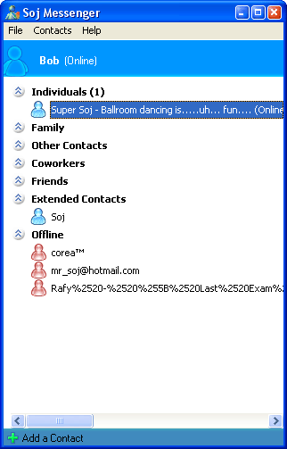



## MSN Client \- MSNP9

### Description

Here is a partly done client for MSN Messenger, it uses MSNP9. It has basic contact list, groups, chat, display pictures aren't working yet, nor are custom emoticons. It isn't commented, and in some places the code is a little difficult to follow.

If you want to work on it further, you can refer to this documentation on hypothetic:

http://www.hypothetic.org/docs/msn/index.php

If you do make any modifications to the code, it would be greatly appreciated if you would send them to me, at: thesoj@gmail.com
 
### More Info
 

             |
---                |---
**Submitted On**   |2004-09-23 12:03:22
**By**             |[Soj](https://github.com/Planet-Source-Code/PSCIndex/blob/master/ByAuthor/soj.md)
**Level**          |Intermediate
**User Rating**    |4.5 (27 globes from 6 users)
**Compatibility**  |VB 6\.0
**Category**       |[Miscellaneous](https://github.com/Planet-Source-Code/PSCIndex/blob/master/ByCategory/miscellaneous__1-1.md)
**World**          |[Visual Basic](https://github.com/Planet-Source-Code/PSCIndex/blob/master/ByWorld/visual-basic.md)
**Archive File**   |[MSN\_Client1798229272004\.zip](https://github.com/Planet-Source-Code/soj-msn-client-msnp9__1-56389/archive/master.zip)

